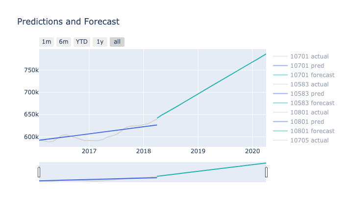

# Realty Rabbit

Realty Rabbit is a `real estate forecast app` that uses `machine learning` and `timeseries analysis` to `predict the mean values of zipcodes in Westchester, New York`.

# Demo

To see the dashboard in action, go to [RealtyRabbit](https://realty-rabbit.herokuapp.com/).

# Source Repo (Jupyter Notebook)

For the complete machine learning model and data science notebook, check out my repository here:
[timeseries-forecasting-with-sarimax-and-gridsearch](https://github.com/hakkeray/timeseries-forecasting-with-sarimax-and-gridsearch)

## Contact

If you want to contact me you can reach me at <rukeine@gmail.com>.

## License

This project uses the following license: [MIT License](./LICENSE.md).
